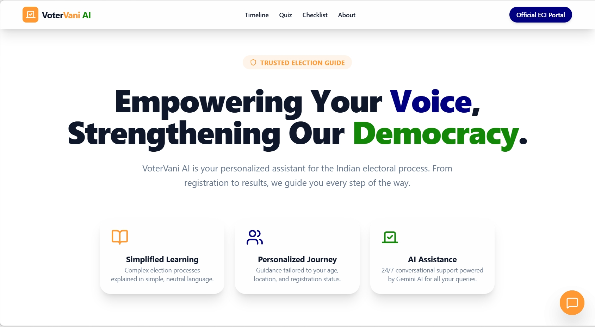

# VoterVani AI 🗳️

> **Empowering Indian Citizens through AI-Driven Electoral Literacy**

**[🌐 Live Demo](https://votervani-ai-817039645342.us-central1.run.app/)**



VoterVani AI is a production-ready, interactive Election Process Education Assistant focused on the Indian Lok Sabha and State Assembly elections. It reduces voter confusion and encourages informed participation through personalized guidance and Gemini-powered intelligence.

## 🌟 Key Features

- **🎯 Smart Onboarding Wizard**: Personalized user journey that adapts based on age, location, and registration status.
- **🛣️ Interactive Election Timeline**: A visual breakdown of the 9 phases of the Indian electoral process.
- **🤖 Gemini-Powered Assistant**: A neutral, factual conversational agent providing instant answers to electoral queries.
- **✅ Dynamic Election Checklist**: Personalized preparation steps with **PDF export** capability.
- **🧠 Knowledge Quiz**: Gamified learning module to test and improve electoral literacy.
- **📍 Polling Day Helper**: Booth locator (mock integration) and essential voting day guidelines.

## 🛠️ Tech Stack

- **Framework**: [Next.js 16+](https://nextjs.org/) (App Router, TypeScript)
- **AI**: [Google Gemini 1.5 Flash](https://ai.google.dev/) (Server-side integration via `@google/generative-ai`)
- **Styling**: [Tailwind CSS v4](https://tailwindcss.com/) (Tricolor theme: Saffron, Ashoka Blue, Green)
- **Testing**: [Vitest](https://vitest.dev/) (Unit/Integration) & [Playwright](https://playwright.dev/) (E2E)
- **Animations**: [Framer Motion](https://www.framer.com/motion/)
- **Icons**: [Lucide React](https://lucide.dev/)
- **PDF Generation**: [jsPDF](https://github.com/parallax/jsPDF)

## 🚀 Getting Started

1. **Clone the repository**:
   ```bash
   git clone <repository-url>
   cd votervani-ai
   ```

2. **Install dependencies**:
   ```bash
   npm install
   ```

3. **Set up environment variables**:
   Create a `.env.local` file with:
   ```env
   GEMINI_API_KEY=your_api_key_here
   ```

4. **Run the development server**:
   ```bash
   npm run dev
   ```

## 🧪 Testing

The project includes a comprehensive testing suite:

- **Unit/Integration Tests**: Run using Vitest.
  ```bash
  npm run test
  ```
- **End-to-End Tests**: Run using Playwright.
  ```bash
  npm run test:e2e
  ```

## 📦 Deployment

This project is optimized for **Google Cloud Run**.

1. Build the production image:
   ```bash
   gcloud builds submit --tag gcr.io/[PROJECT_ID]/votervani-ai
   ```
2. Deploy to Cloud Run:
   ```bash
   gcloud run deploy votervani-ai --image gcr.io/[PROJECT_ID]/votervani-ai --platform managed
   ```

## 📖 Approach & Logic

VoterVani AI uses a **context-aware branching engine**. Based on the initial onboarding data:
- **Under 18**: Focuses on future voter education and registration timelines.
- **Unregistered**: Provides direct links to Form 6 and registration guides.
- **Registered**: Focuses on booth location, ID requirements, and the voting process.

---

*Note: This project is an educational tool and is not officially affiliated with the Election Commission of India. Always refer to [eci.gov.in](https://eci.gov.in) for official directives.*
